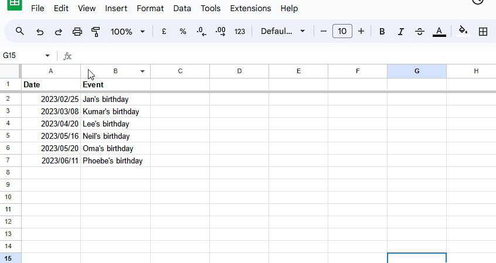
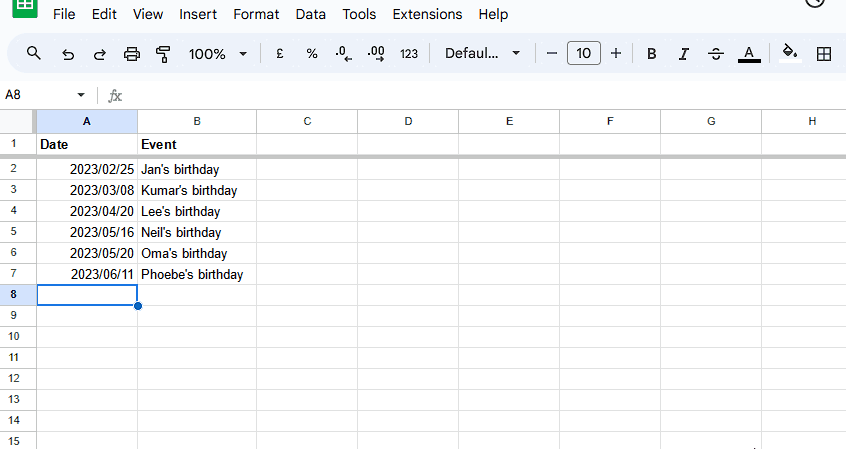
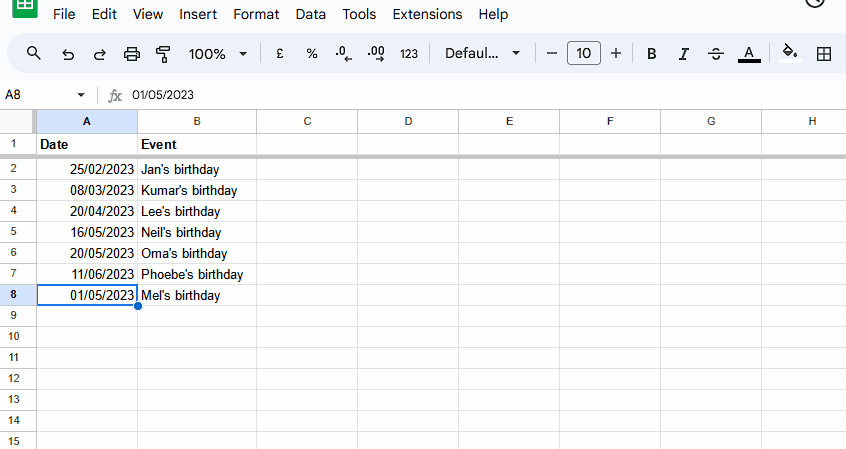
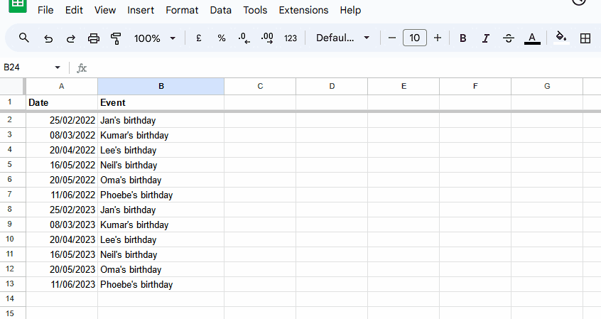

# diarise

Getting dates in order, for those with imperfect timing

## Aims

Diarise has three main aims:

 1. **Plain-text date- and time- stamps**: Devise a plain-text notation and functions for handling dates and times, such that:
     - We can use it to express uncertainty about dates and times
     - Lexical order = chronological order
 2. **Helper functions**: Create helper functions that:
     - Automate homogenisation of dates and times where needed making plain-text transcription easier
     - Convert plain text to special types or classes of object and back again
 3. **Calendar grammar**: Enable a calendar grammar so that:
     - The conventions and functions created are clearly documented
     - We can easily devise similar conventions for alternative or fantasy calendars, to equip historians or empower creators or fans of fiction

### 1. Plain-text date- and time-stamps

Conversion and sorting of dates cross many tools is inconsistent and unintuitive.

> 

> 
Problem example: Google Sheets

>
> Let's say that you have a list of dates that you want to put in order.
>
> Put them into a spreadsheet (like Google Sheets) and the tool will convert them into a special date format.
>
> You can then even change the format of these dates at the click of a button.
>
> 
>
> But if there's any uncertainty around your date, you may become stuck.
>
> Let's say you know about an event in May 2023 but you don't know when. So you type `2023/05`.
>
> Google Sheets will interpret that as 1st May 2022 for you. It will continue to display `2023/05` but it's easy to lose the fact that you didn't know the actual day.
>
> And if you format that cell to match others in your column, you'll lose the vagueness you were trying to express.
>
> 
>
> n this case, your date will still sort okay -- after April 2023 but before more specific dates in May 2023. But you might  trick yourself into thinking you have something more exact than you had to start with.
>
> And if you mark the date with a question mark, Google Sheets won't understand and won't treat it as a date at all. Then your date will fall outside the usual sorting order. You won't be able to see at a glance where it should be in the list of more specific dates you have.
>
> 
>
> It gets worse... If you know of an event in 2023 but don't even know which month it's in then watch out. Put that in your column and you won't be able to sort it between dates in surrounding years. And if you format it like the rest of the column, you'll be in for a surprise...
>
> 
> 

One aim of this project is to come up with a set of conventions that allow you to record a date up to a required level of specificity and still be able to sort it meaningfully.

### 2. Helper functions

It should be possible to convert a plain-text date into a standard JavaScript date object if needed, or into other formats.

Custom formats that preserve the uncertainty, providing a cross-compatible date object  with other properties, could be used in graphing and data visualisation.

### 3. Calendar grammar

With any set of conventions there's at the very least an implicit grammar at work.

This project aims not only to make that grammar explicit but also allow users to leverage it to create their own calendar systems.

For example, one might want to an easy notation for the French Revolutionary Calendar if working with documents from that time. Or one might want a notation for the Shire Calendar from Tolkien's _Lord of the Rings_.
